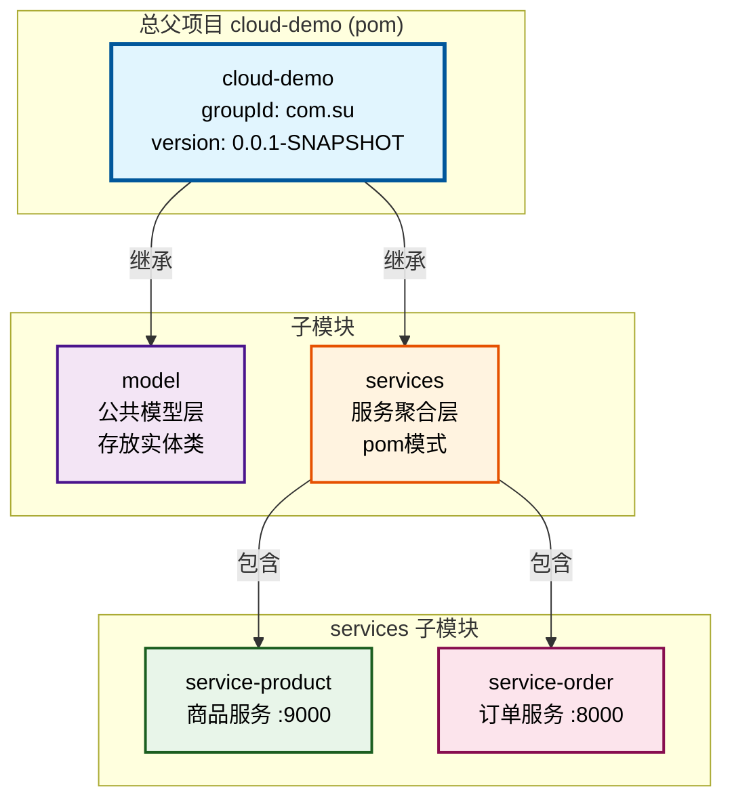
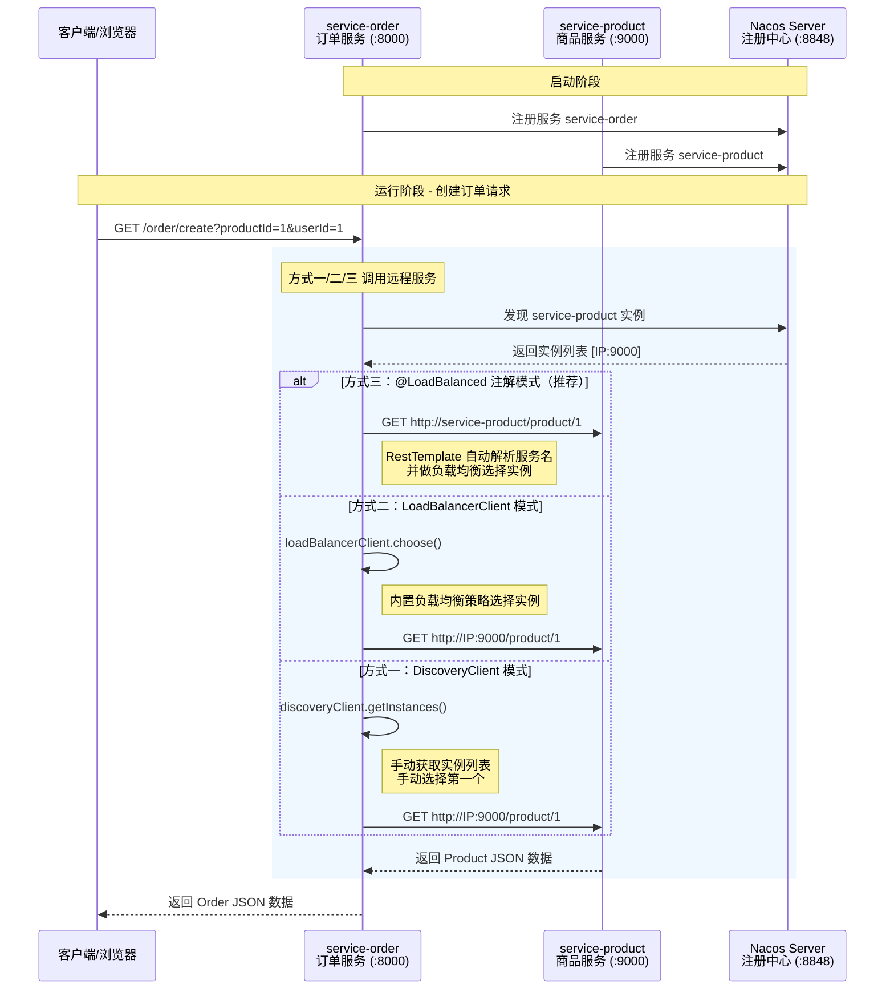

# Spring Cloud Alibaba 学习流程文档

## 项目结构总览

```
cloud-demo                          # 总父项目（依赖管理）
├── model                           # 公共模型（Product、Order）
└── services                        # 服务聚合层（pom模式，公共依赖）
    ├── service-product             # 商品服务 :9000
    └── service-order               # 订单服务 :8000
```

---

## 服务间关系图

### 1. Maven 模块层级关系（继承与聚合）



**说明**：
- **cloud-demo**：总父项目，统一管理所有依赖版本（dependencyManagement）
- **model**：独立子模块，被 services 依赖，提供公共实体类
- **services**：中间层 pom 项目，聚合微服务模块，统一配置 Spring Cloud 公共依赖
- **service-product / service-order**：具体的微服务应用

---

### 2. 服务运行时调用关系



---

## 学习流程一：搭建总父项目 cloud-demo

### 1.1 创建项目

新建 Maven 项目 `cloud-demo`，设置 `<packaging>pom</packaging>`，表示这是一个聚合项目，本身不产出代码。

### 1.2 配置依赖管理

```xml
<parent>
    <groupId>org.springframework.boot</groupId>
    <artifactId>spring-boot-starter-parent</artifactId>
    <version>3.3.4</version>
</parent>

<packaging>pom</packaging>

<groupId>com.su</groupId>
<artifactId>cloud-demo</artifactId>
<version>0.0.1-SNAPSHOT</version>

<modules>
    <module>services</module>
    <module>model</module>
</modules>
```

### 1.3 版本属性定义

```xml
<properties>
    <spring-cloud.version>2023.0.3</spring-cloud.version>
    <spring-cloud-alibaba.version>2023.0.3.2</spring-cloud-alibaba.version>
    <lombok.version>1.18.36</lombok.version>
</properties>
```

> **版本对应关系**：

| Spring Boot | Spring Cloud | Spring Cloud Alibaba | Nacos Server |
|-------------|-------------|---------------------|--------------|
| 3.3.4 | 2023.0.3 | 2023.0.3.2 | 2.4.3 |

> 版本不匹配会导致启动失败。

### 1.4 依赖管理（dependencyManagement）

```xml
<dependencyManagement>
    <dependencies>
        <!-- Spring Cloud BOM -->
        <dependency>
            <groupId>org.springframework.cloud</groupId>
            <artifactId>spring-cloud-dependencies</artifactId>
            <version>${spring-cloud.version}</version>
            <type>pom</type>
            <scope>import</scope>
        </dependency>
        <!-- Spring Cloud Alibaba BOM -->
        <dependency>
            <groupId>com.alibaba.cloud</groupId>
            <artifactId>spring-cloud-alibaba-dependencies</artifactId>
            <version>${spring-cloud-alibaba.version}</version>
            <type>pom</type>
            <scope>import</scope>
        </dependency>
        <!-- Lombok -->
        <dependency>
            <groupId>org.projectlombok</groupId>
            <artifactId>lombok</artifactId>
            <version>${lombok.version}</version>
        </dependency>
    </dependencies>
</dependencyManagement>
```

> **关键点**：`dependencyManagement` 只声明版本，不实际引入依赖。子模块需要显式声明才会引入，这样可以统一管理版本，避免冲突。

---

## 学习流程二：新增子项目 services（pom 模式）

### 2.1 创建 services 模块

```xml
<parent>
    <groupId>com.su</groupId>
    <artifactId>cloud-demo</artifactId>
    <version>0.0.1-SNAPSHOT</version>
</parent>

<packaging>pom</packaging>
<artifactId>services</artifactId>

<modules>
    <module>service-product</module>
    <module>service-order</module>
</modules>
```

> **为什么用 pom 模式**：services 本身不写代码，只是作为服务子模块的聚合层，统一管理微服务的公共依赖。

---

## 学习流程三：新增 service-order 和 service-product 子模块

### 3.1 service-product

```xml
<parent>
    <groupId>com.su</groupId>
    <artifactId>services</artifactId>
    <version>0.0.1-SNAPSHOT</version>
</parent>

<artifactId>service-product</artifactId>

<dependencies>
    <dependency>
        <groupId>org.springframework.boot</groupId>
        <artifactId>spring-boot-starter-web</artifactId>
    </dependency>
</dependencies>
```

### 3.2 service-order

```xml
<parent>
    <groupId>com.su</groupId>
    <artifactId>services</artifactId>
    <version>0.0.1-SNAPSHOT</version>
</parent>

<artifactId>service-order</artifactId>

<dependencies>
    <dependency>
        <groupId>org.springframework.boot</groupId>
        <artifactId>spring-boot-starter-web</artifactId>
    </dependency>
    <dependency>
        <groupId>org.springframework.boot</groupId>
        <artifactId>spring-boot-starter-test</artifactId>
    </dependency>
    <dependency>
        <groupId>org.springframework.cloud</groupId>
        <artifactId>spring-cloud-starter-loadbalancer</artifactId>
    </dependency>
</dependencies>
```

> **注意**：service-order 额外引入了 `spring-cloud-starter-loadbalancer`，因为 order 服务需要调用 product 服务，需要负载均衡能力。

---

## 学习流程四：services 项目配置 Spring Cloud 相关依赖

在 services 的 pom.xml 中统一配置微服务公共依赖：

```xml
<dependencies>
    <!-- 服务发现：Nacos -->
    <dependency>
        <groupId>com.alibaba.cloud</groupId>
        <artifactId>spring-cloud-starter-alibaba-nacos-discovery</artifactId>
    </dependency>
    <!-- 服务调用：OpenFeign -->
    <dependency>
        <groupId>org.springframework.cloud</groupId>
        <artifactId>spring-cloud-starter-openfeign</artifactId>
    </dependency>
    <!-- Lombok -->
    <dependency>
        <groupId>org.projectlombok</groupId>
        <artifactId>lombok</artifactId>
        <scope>annotationProcessor</scope>
    </dependency>
    <!-- 公共模型 -->
    <dependency>
        <groupId>com.su</groupId>
        <artifactId>model</artifactId>
        <version>0.0.1-SNAPSHOT</version>
    </dependency>
</dependencies>
```

> **关键点**：
> - 公共依赖放在 services 层，子模块自动继承，无需重复声明
> - `lombok` 的 scope 设为 `annotationProcessor`，只在编译时使用，不打包到最终产物
> - `model` 模块存放公共实体类（Product、Order），供多个服务共享

### 补充：model 模块

model 模块作为公共模型层，存放跨服务共享的实体类：

**Product.java**
```java
package com.su.product.bean;

import lombok.Data;
import java.math.BigDecimal;

@Data
public class Product {
    private Long id;
    private BigDecimal price;
    private String productName;
    private int num;
}
```

**Order.java**
```java
package com.su.order.bean;

import com.su.product.bean.Product;
import lombok.Data;
import java.math.BigDecimal;
import java.util.List;

@Data
public class Order {
    private Long id;
    private BigDecimal totalPrice;
    private Long userId;
    private String nickname;
    private String address;
    private String productName;
    private List<Product> productList;
}
```

---

## 学习流程五：编写 order 服务和 product 服务的业务代码

### 5.1 配置文件

**service-product → application.yaml**
```yaml
spring:
  application:
    name: service-product
  cloud:
    nacos:
      server-addr: 127.0.0.1:8848
server:
  port: 9000
```

**service-order → application.yaml**
```yaml
spring:
  application:
    name: service-order
  cloud:
    nacos:
      server-addr: 127.0.0.1:8848
server:
  port: 8000
```

> **关键点**：`spring.application.name` 是服务注册到 Nacos 的服务名，后续服务间调用会用到这个名称。

### 5.2 启动类

**ProductMainApplication.java**
```java
package com.su.product;

import org.springframework.boot.SpringApplication;
import org.springframework.boot.autoconfigure.SpringBootApplication;

@SpringBootApplication
public class ProductMainApplication {
    public static void main(String[] args) {
        SpringApplication.run(ProductMainApplication.class, args);
    }
}
```

**OrderMainApplication.java**
```java
package com.su.order;

import org.springframework.boot.SpringApplication;
import org.springframework.boot.autoconfigure.SpringBootApplication;
import org.springframework.cloud.client.discovery.EnableDiscoveryClient;

@EnableDiscoveryClient
@SpringBootApplication
public class OrderMainApplication {
    public static void main(String[] args) {
        SpringApplication.run(OrderMainApplication.class, args);
    }
}
```

> **注意**：`@EnableDiscoveryClient` 在新版本中可以省略（自动装配），但显式声明更清晰。

### 5.3 Product 服务业务代码

**接口：ProductService.java**
```java
package com.su.product.service.impl;

import com.su.product.bean.Product;

public interface ProductService {
    Product getProductById(Long productId);
}
```

**实现：ProductServiceImpl.java**
```java
package com.su.product.service;

import com.su.product.bean.Product;
import com.su.product.service.impl.ProductService;
import org.springframework.stereotype.Service;
import java.math.BigDecimal;

@Service
public class ProductServiceImpl implements ProductService {
    @Override
    public Product getProductById(Long productId) {
        Product product = new Product();
        product.setId(productId);
        product.setPrice(BigDecimal.valueOf(100));
        product.setProductName("apple" + productId);
        product.setNum(2);
        return product;
    }
}
```

> **易错点**：`@Service` 必须加在实现类上，不能加在接口上。Spring 只能实例化具体类，接口无法创建对象。

**控制器：ProductController.java**
```java
package com.su.product.controller;

import com.su.product.bean.Product;
import com.su.product.service.impl.ProductService;
import lombok.RequiredArgsConstructor;
import org.springframework.web.bind.annotation.*;

@RequiredArgsConstructor
@RestController
@RequestMapping("/product")
public class ProductController {
    private final ProductService productService;

    @RequestMapping("/{id}")
    public Product getProduct(@PathVariable("id") Long productId) {
        return productService.getProductById(productId);
    }
}
```

> **接口地址**：`GET /product/{id}`

### 5.4 Order 服务业务代码

**接口：OrderService.java**
```java
package com.su.order.service.impl;

import com.su.order.bean.Order;

public interface OrderService {
    Order createOrder(Long productId, Long userId);
}
```

**实现：OrderServiceImpl.java**（核心，包含三种远程调用方式）
```java
package com.su.order.service;

import com.su.order.bean.Order;
import com.su.order.service.impl.OrderService;
import com.su.product.bean.Product;
import lombok.RequiredArgsConstructor;
import lombok.extern.slf4j.Slf4j;
import org.springframework.cloud.client.ServiceInstance;
import org.springframework.cloud.client.discovery.DiscoveryClient;
import org.springframework.cloud.client.loadbalancer.LoadBalancerClient;
import org.springframework.stereotype.Service;
import org.springframework.web.client.RestTemplate;

import java.math.BigDecimal;
import java.util.List;

@Slf4j
@RequiredArgsConstructor
@Service
public class OrderServiceImpl implements OrderService {

    private final DiscoveryClient discoveryClient;
    private final RestTemplate restTemplate;
    private final LoadBalancerClient loadBalancerClient;

    @Override
    public Order createOrder(Long productId, Long userId) {
        Product product = getProductFromRemote(productId);
        Order order = new Order();
        order.setId(1L);
        order.setTotalPrice(product.getPrice().multiply(new BigDecimal(product.getNum())));
        order.setUserId(userId);
        order.setNickname("az");
        order.setAddress("公寓");
        order.setProductList(List.of(product));
        return order;
    }

    // 方式一：服务发现模式
    private Product getProductFromRemote(Long productId) { ... }

    // 方式二：负载均衡 Client 模式
    private Product getProductFromRemoteWithBalance(Long productId) { ... }

    // 方式三：负载均衡注解模式
    private Product getProductFromRemoteWithBalanceAnnotation(Long productId) { ... }
}
```

**控制器：OrderController.java**
```java
package com.su.order.controller;

import com.su.order.bean.Order;
import com.su.order.service.impl.OrderService;
import lombok.RequiredArgsConstructor;
import org.springframework.web.bind.annotation.*;

@RequiredArgsConstructor
@RestController
@RequestMapping("/order")
public class OrderController {
    private final OrderService orderService;

    @RequestMapping("/create")
    public Order createOrder(@RequestParam Long productId, @RequestParam Long userId) {
        return orderService.createOrder(productId, userId);
    }
}
```

> **接口地址**：`GET /order/create?productId=1&userId=1`

### 5.5 RestTemplate 配置

**service-order 的 RestTemplateConfig.java**
```java
package com.su.order.config;

import org.springframework.cloud.client.loadbalancer.LoadBalanced;
import org.springframework.context.annotation.Bean;
import org.springframework.context.annotation.Configuration;
import org.springframework.web.client.RestTemplate;

@Configuration
public class RestTemplateConfig {
    @LoadBalanced
    @Bean
    public RestTemplate restTemplate() {
        return new RestTemplate();
    }
}
```

> **关键点**：
> - `RestTemplate` 不是 Spring 自动配置的 Bean，需要手动创建
> - `@LoadBalanced` 让 RestTemplate 支持服务名访问（如 `http://service-product/...`）
> - `@LoadBalanced` 本质是给 RestTemplate 添加了拦截器，自动做服务发现和负载均衡

---

## 学习流程六：测试 order 服务创建订单接口

### 前置条件

1. 启动 Nacos Server（默认地址 `127.0.0.1:8848`）
2. 启动 `ProductMainApplication`（端口 9000）
3. 启动 `OrderMainApplication`（端口 8000）
4. 确认两个服务都已注册到 Nacos

### 测试接口

```
GET http://localhost:8000/order/create?productId=1&userId=1
```

### 6.1 方式一：服务发现模式下获取 URL 调用 Product

```java
private Product getProductFromRemote(Long productId) {
    // 1. 通过 DiscoveryClient 获取服务实例列表
    List<ServiceInstance> instances = discoveryClient.getInstances("service-product");
    // 2. 手动选择第一个实例（没有负载均衡）
    ServiceInstance instance = instances.get(0);
    // 3. 手动拼接 URL
    String url = "http://" + instance.getHost() + ":" + instance.getPort() + "/product/" + productId;
    log.info("远程请求url: {}", url);
    // 4. 使用 RestTemplate 发起请求
    return restTemplate.getForObject(url, Product.class);
}
```

**流程图**：
```
OrderService
    │
    ├─→ DiscoveryClient.getInstances("service-product")
    │       └─→ 从 Nacos 获取实例列表 [instance1, instance2, ...]
    │
    ├─→ instances.get(0)  ← 手动选择，无负载均衡
    │
    ├─→ 拼接 URL: http://192.168.1.10:9000/product/1
    │
    └─→ RestTemplate.getForObject(url, Product.class)
```

**缺点**：
- 手动选择实例，始终取第一个，**没有负载均衡**
- 手动拼接 URL，容易出错
- 需要注入 `DiscoveryClient`，增加依赖

### 6.2 方式二：负载均衡 Client 模式下获取 URL 调用 Product

```java
private Product getProductFromRemoteWithBalance(Long productId) {
    // 1. 通过 LoadBalancerClient 选择一个实例（自带负载均衡策略）
    ServiceInstance instance = loadBalancerClient.choose("service-product");
    // 2. 手动拼接 URL
    String url = "http://" + instance.getHost() + ":" + instance.getPort() + "/product/" + productId;
    log.info("远程请求url: {}，服务实例: {}", url, instance.getHost() + ":" + instance.getPort());
    // 3. 使用 RestTemplate 发起请求
    return restTemplate.getForObject(url, Product.class);
}
```

**流程图**：
```
OrderService
    │
    ├─→ LoadBalancerClient.choose("service-product")
    │       └─→ 根据负载均衡策略选择一个实例 ← 自动负载均衡
    │
    ├─→ 拼接 URL: http://192.168.1.11:9000/product/1
    │
    └─→ RestTemplate.getForObject(url, Product.class)
```

**优点**：内置负载均衡策略（轮询等），不再固定选第一个实例

**缺点**：仍需手动拼接 URL

> **注意**：`LoadBalancerClient` 的正确导入路径是 `org.springframework.cloud.client.loadbalancer.LoadBalancerClient`（接口），而不是 `org.springframework.cloud.loadbalancer.annotation.LoadBalancerClient`（注解）。

### 6.3 方式三：负载均衡注解模式下获取 URL 调用 Product

```java
private Product getProductFromRemoteWithBalanceAnnotation(Long productId) {
    // 直接使用服务名作为主机名，RestTemplate 自动解析
    String url = "http://service-product/product/" + productId;
    log.info("远程请求url: {}", url);
    return restTemplate.getForObject(url, Product.class);
}
```

**流程图**：
```
OrderService
    │
    └─→ RestTemplate.getForObject("http://service-product/product/1")
            │
            ├─→ @LoadBalanced 拦截器拦截请求
            │
            ├─→ 解析服务名 "service-product"
            │
            ├─→ 从注册中心获取实例列表
            │
            ├─→ 负载均衡选择实例
            │
            └─→ 替换为真实 IP:Port 发起请求
```

**前提条件**：RestTemplate 必须添加 `@LoadBalanced` 注解
```java
@Configuration
public class RestTemplateConfig {
    @LoadBalanced  // 关键！让 RestTemplate 具备负载均衡能力
    @Bean
    public RestTemplate restTemplate() {
        return new RestTemplate();
    }
}
```

**优点**：
- 代码最简洁，无需手动获取实例和拼接 URL
- 自动负载均衡
- 使用服务名而非 IP，天然支持服务扩缩容

**缺点**：需要理解 `@LoadBalanced` 的工作原理（拦截器模式）

### 三种方式对比

| 对比项 | 方式一：DiscoveryClient | 方式二：LoadBalancerClient | 方式三：@LoadBalanced |
|--------|------------------------|---------------------------|----------------------|
| 负载均衡 | ❌ 无 | ✅ 有 | ✅ 有 |
| URL 拼接 | 手动拼接 IP:Port | 手动拼接 IP:Port | 直接用服务名 |
| 代码复杂度 | 高 | 中 | 低 |
| 需要额外注入 | DiscoveryClient | LoadBalancerClient | 无 |
| 推荐程度 | ⭐ | ⭐⭐ | ⭐⭐⭐ |

---

## 附录：常见问题

### Q1：ProductService 无法注入？
检查 `ProductServiceImpl` 是否添加了 `@Service` 注解。Spring 只能实例化具体类，`@Service` 不能加在接口上。

### Q2：RestTemplate 无法注入？
`RestTemplate` 不是 Spring 自动配置的 Bean，需要手动创建配置类，用 `@Bean` 注册。

### Q3：LoadBalancerClient 导入报错？
注意区分两个同名的类：
- ✅ `org.springframework.cloud.client.loadbalancer.LoadBalancerClient`（接口，用于注入）
- ❌ `org.springframework.cloud.loadbalancer.annotation.LoadBalancerClient`（注解，用于配置策略）

### Q4：lombok 的 scope 为什么是 annotationProcessor？
lombok 是编译时注解处理器，只在编译阶段生成代码（getter/setter 等），运行时不需要，所以不打包到最终产物中。

### Q5：@EnableDiscoveryClient 是否必须？
Spring Cloud 新版本中，引入了 `spring-cloud-starter-alibaba-nacos-discovery` 依赖后会自动开启服务发现，`@EnableDiscoveryClient` 可以省略，但显式声明更清晰。

---

## 知识点

### 一、服务调用

#### 1.1 RestTemplate + @LoadBalanced 完整调用流程

以 `restTemplate.getForObject("http://service-product/product/1", Product.class)` 为例：

```
RestTemplate 发起请求
    │
    │  URL: http://service-product/product/1
    │
    ▼
@LoadBalanced 拦截器（LoadBalancerInterceptor）拦截请求
    │
    │  ① 提取服务名: "service-product"
    │
    ▼
Spring Cloud LoadBalancer
    │
    │  ② 查询本地缓存中的服务实例列表
    │     ┌─────────────────────────────────────┐
    │     │  本地缓存（ServiceInstanceList）      │
    │     │  service-product → [10.0.0.1:9000]  │
    │     └─────────────────────────────────────┘
    │
    │  缓存未命中（首次请求）→ 主动请求 Nacos 获取服务列表
    │  缓存已命中           → 直接使用缓存中的列表
    │
    │  ③ 根据负载均衡策略（默认轮询）选择一个实例
    │
    ▼
替换 URL
    │
    │  http://service-product/product/1
    │  → http://10.0.0.1:9000/product/1
    │
    ▼
RestTemplate 发起真实 HTTP 请求 → 返回结果
```

### 二、服务注册与发现

#### 2.1 Nacos 服务列表缓存与同步机制

```
┌──────────────┐         主动拉取（首次）          ┌──────────────┐
│              │ ──────────────────────────────→  │              │
│   消费者服务  │                                   │    Nacos     │
│  (service-   │ ←──────────────────────────────  │    Server    │
│   order)     │         推送变更（后续）            │              │
└──────┬───────┘                                   └──────────────┘
       │
       ▼
┌──────────────┐
│  本地缓存     │
│              │
│ service-     │
│ product →    │
│ [实例列表]    │
└──────────────┘
```

**缓存更新策略**：

| 阶段 | 触发方式 | 说明 |
|------|---------|------|
| 首次调用 | 消费者**主动拉取** | 第一次请求某服务时，本地缓存为空，主动向 Nacos 请求服务列表 |
| 后续更新 | Nacos **主动推送** | 服务列表发生变动时（上线/下线），Nacos 通过长连接推送变更到消费者，更新本地缓存 |

#### 2.2 Nacos 挂了，还能正常发起服务请求吗？

分两种情况分析：

**情况一：之前已经调用过 Nacos 获取过服务列表（缓存中已有数据）**

```
Nacos Server ✗ (宕机)
       │
       ✗ 推送变更失败
       │
消费者服务
       │
       ├── 本地缓存仍持有旧的服务列表
       │
       ├── RestTemplate 仍可从缓存中获取实例并发起请求
       │
       └── ✅ 可以正常调用（短期内）
       
       ⚠️ 但存在风险：
       ├── 如果目标服务下线 → 缓存中仍有该实例 → 请求失败
       └── 如果新服务上线 → 缓存中没有该实例 → 无法被调用
```

**结论**：✅ 短期内可以正常请求，但无法感知服务列表变更

**情况二：从未调用过 Nacos 获取服务列表（缓存为空）**

```
Nacos Server ✗ (宕机)
       │
       ✗ 主动拉取失败
       │
消费者服务
       │
       ├── 本地缓存为空
       │
       ├── 无法获取任何服务实例
       │
       └── ❌ 无法发起请求，直接报错
```

**结论**：❌ 完全无法请求

**总结**：

| 场景 | 缓存状态 | 能否请求 | 风险 |
|------|---------|---------|------|
| Nacos 挂了，之前已调用过 | 有缓存 | ✅ 能（短期） | 无法感知服务上下线 |
| Nacos 挂了，从未调用过 | 无缓存 | ❌ 不能 | 无法获取服务实例 |

> 这也是为什么 Nacos 推荐**集群部署**的原因——单点故障会导致服务发现能力下降，而集群可以保证高可用。